# Математическое моделирование колебаний двойного маятника методом Дормана-Принса 5 порядка

## Зависимости
Python3, numpy, matplotlib

## Описание
Для численного моделирования использовался метод Дормана-Принца 5 порядка.
На каждом шаге в качестве функции изменения угла отклонения использовалась следующие уравнения Гамильтона:

Здесь, a1, a2 - текущий угол 1 и 2 тел (второе тело прикреплено к первому), p1 и p2 - их инерция, A1 и А2 - вспомогательные переменные, l1 и l2 - длины стержней.

    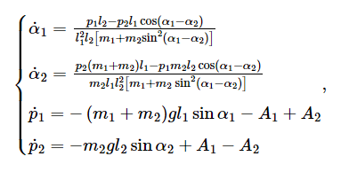

    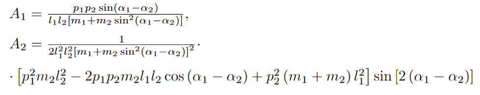

В учебной модели длины стержней взяты одинаковые (l1 = l2 = l), &mu; - отношение массы второго тела к массе первого, из-за чего система получает следующий вид:

    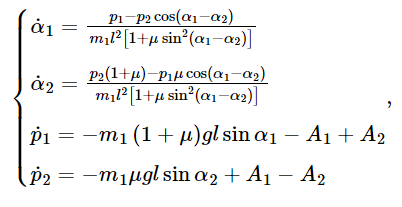
    

    

Также к конечным результатам был применен шум, реализованный как случайное число в нормальном распределении, с мат ожиданием 0.2 и дисперсией 0.2.

## Пример результата

### Первый:

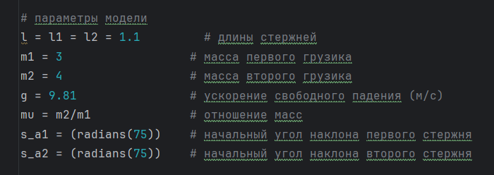

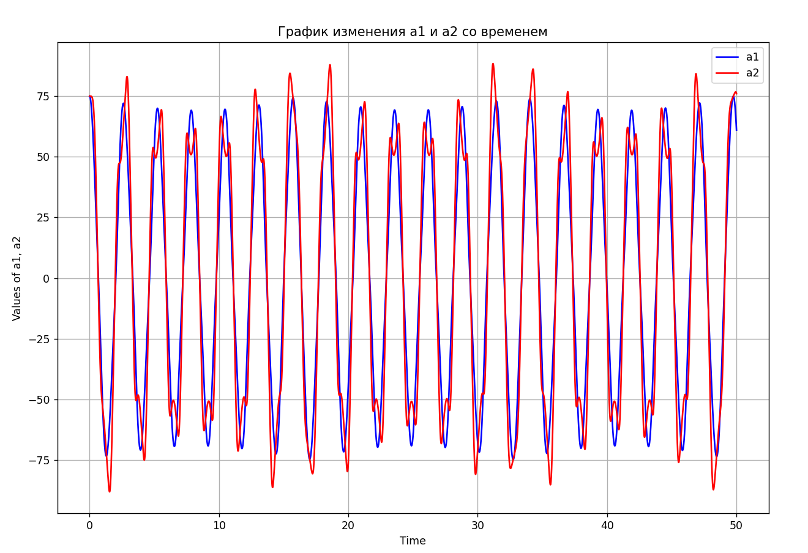

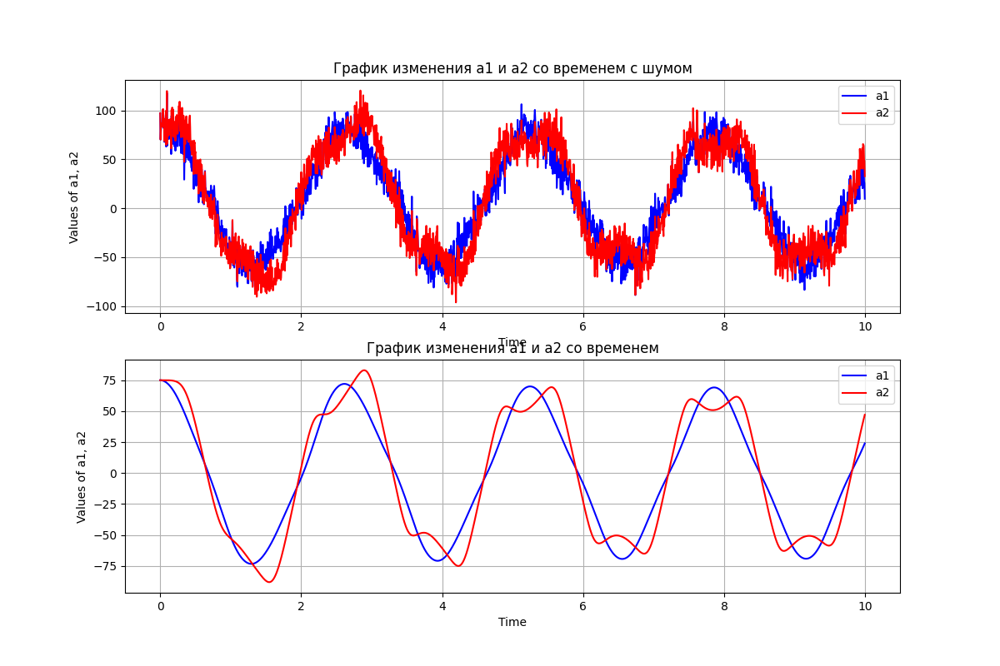

### Второй:

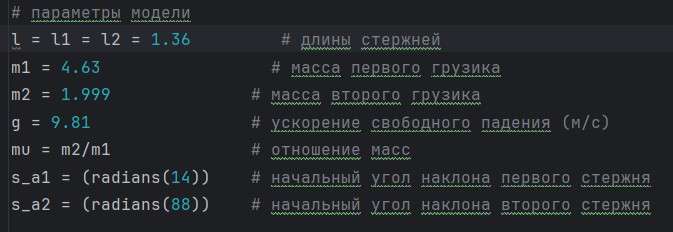

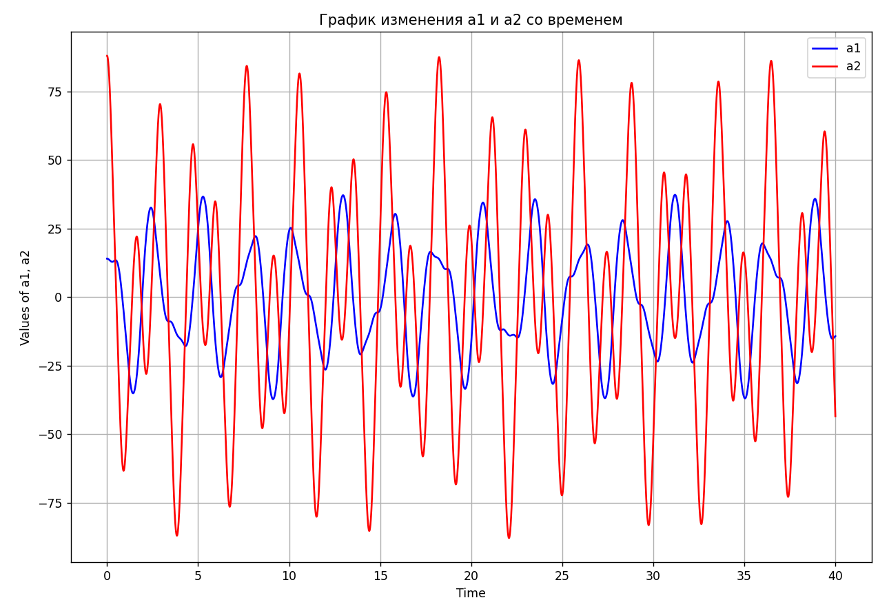

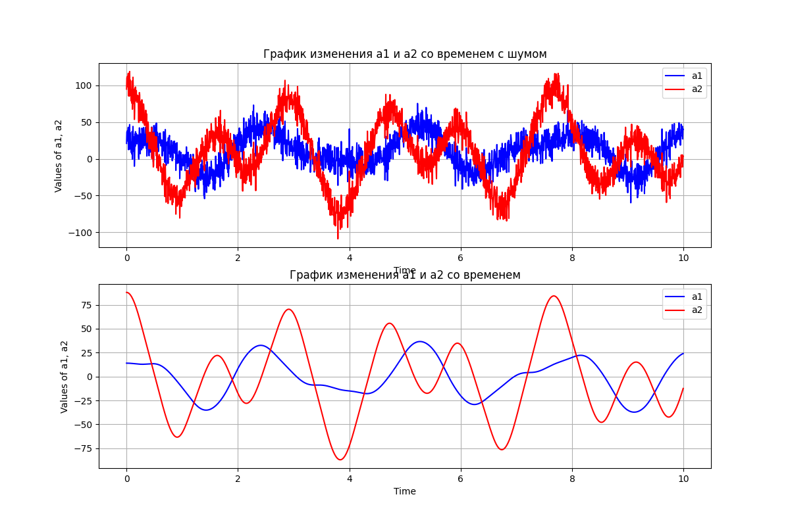

### Третий:

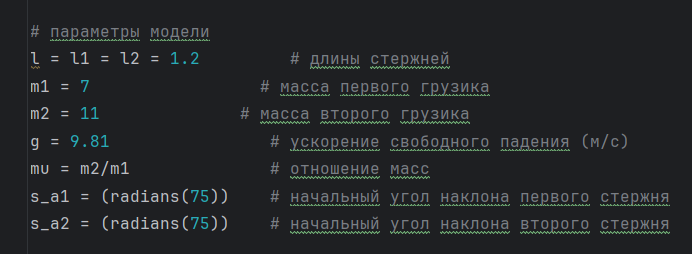

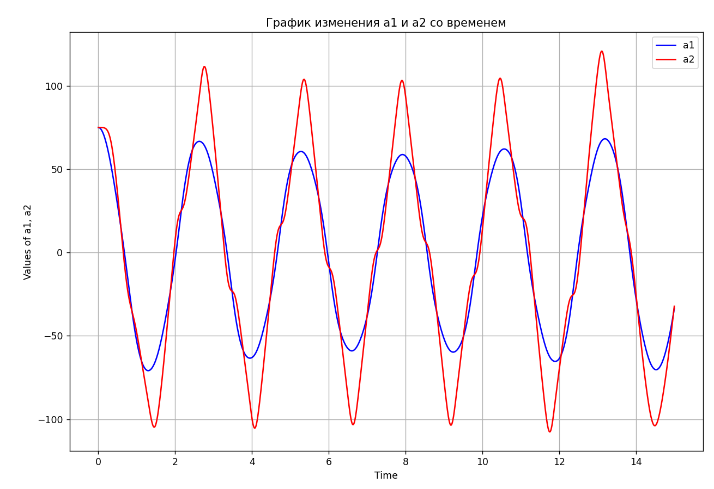

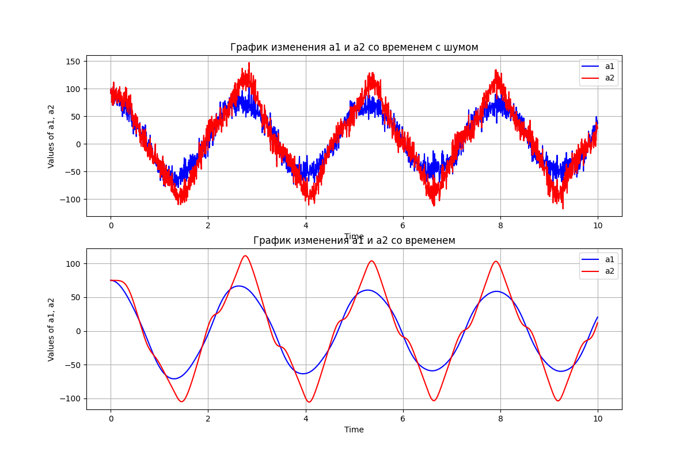

### Четвертый:

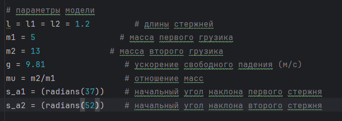

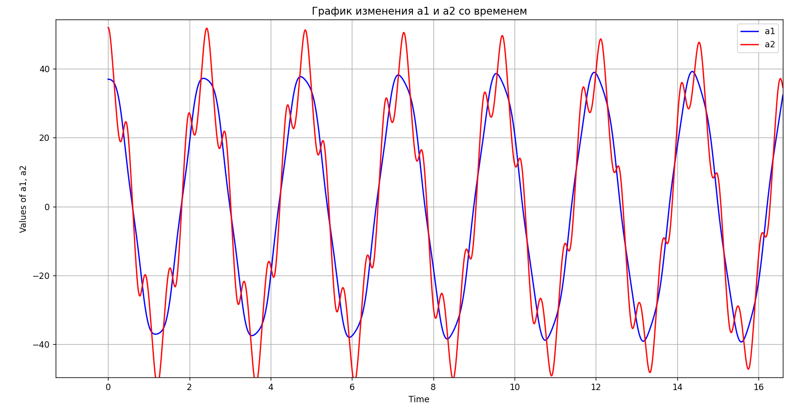

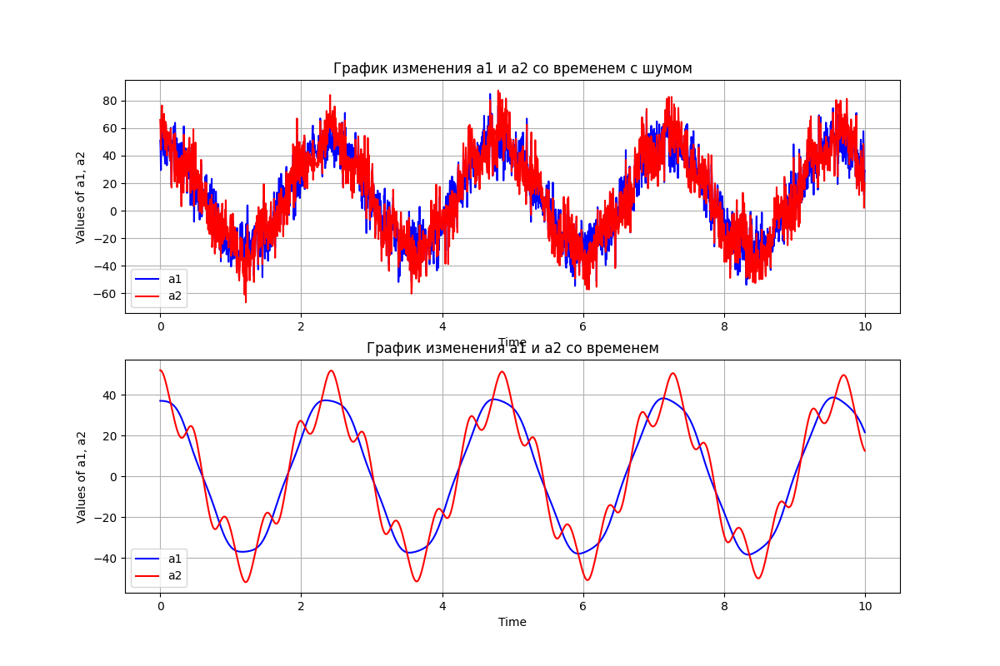

### Пятый:

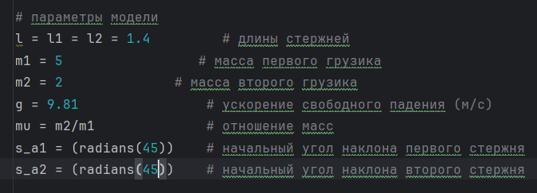

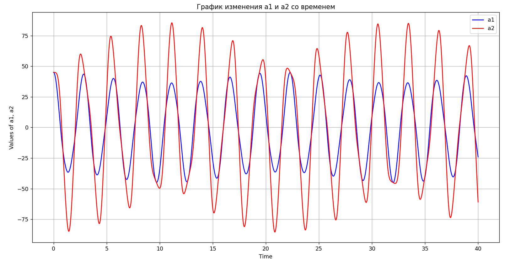

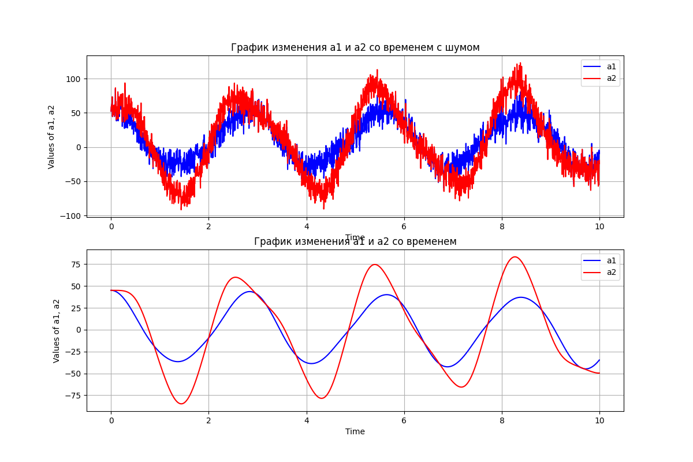

### Шестой:

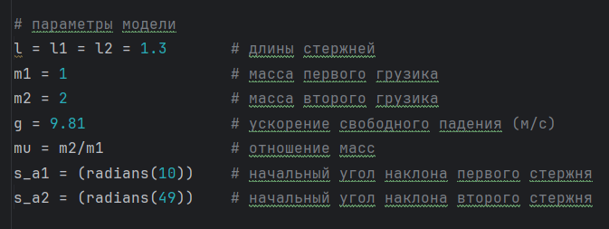

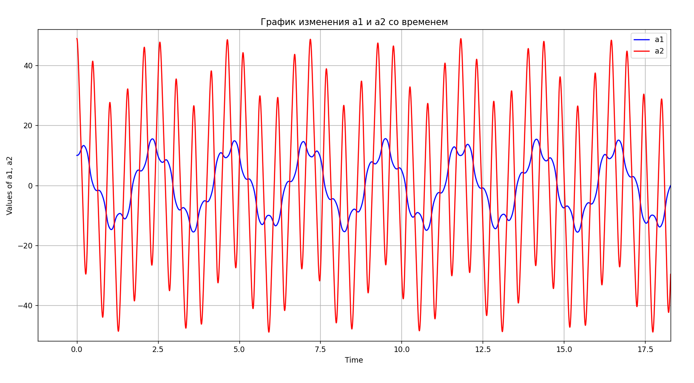

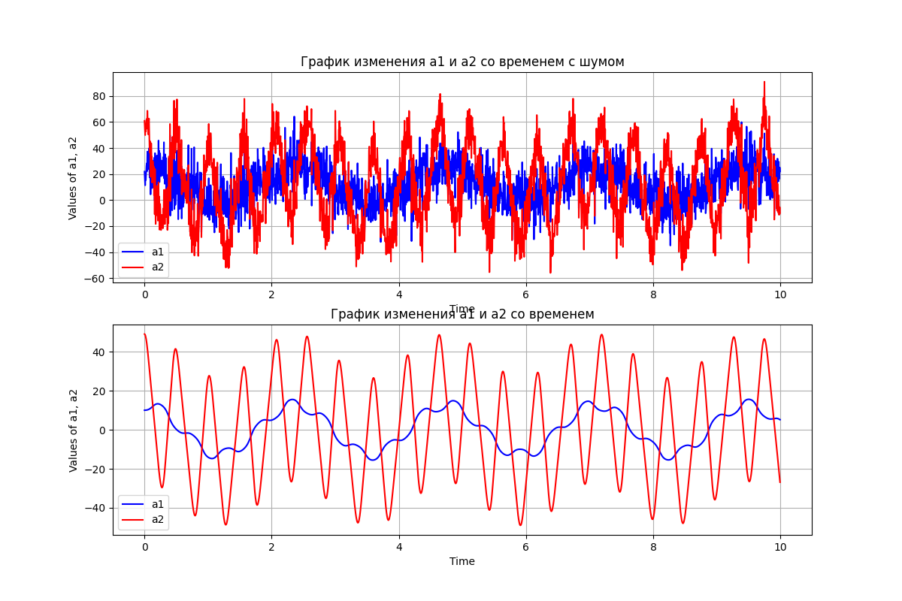

# Фильтр Калмана

Фильтр Калмана — это алгоритм, используемый для оценки состояния системы в условиях неопределенности, когда данные наблюдений могут быть зашумлены. Он находит применение в задачах фильтрации сигналов, навигации, управления и прогнозирования.

---

## Основные принципы работы

### Моделирование системы

Фильтр Калмана основывается на двух уравнениях, описывающих поведение системы:

1. **Уравнение состояния:**
   $x_k = F_k x_{k-1} + B_k u_k + w_k$
   - $x_k$: состояние системы на шаге $k$;
   - $F_k$: матрица перехода, описывающая изменение состояния;
   - $B_k$: матрица управления;
   - $u_k$: вектор управления;
   - $w_k$: шум процесса, предполагается нормально распределённым ($N(0, Q_k)$).

2. **Уравнение измерения:**
   $z_k = H_k x_k + v_k$
   - $z_k$: вектор наблюдений;
   - $H_k$: матрица, связывающая состояние с наблюдаемыми переменными;
   - $v_k$: шум измерений, предполагается нормально распределённым ($N(0, R_k)$).

---

## Алгоритм работы

Фильтр Калмана состоит из двух этапов:

### Этап предсказания
1. **Предсказание состояния:**
   x̂_(k|k-1) = F_k * x̂_(k-1|k-1) + B_k * u_k

2. **Предсказание ковариации ошибки:**
   $P_{k|k-1} = F_k P_{k-1|k-1} F_k^T + Q_k$

### Этап обновления
1. **Вычисление остатка (инновации):**
   $y_k = z_k - H_k \hat{x}_{k|k-1}$

2. **Вычисление ковариации остатка:**
   $S_k = H_k P_{k|k-1} H_k^T + R_k$

3. **Коэффициент Калмана:**
   $K_k = P_{k|k-1} H_k^T S_k^{-1}$

4. **Обновление оценки состояния:**
   x̂_(k|k) = x̂_(k|k-1) + K_k * y_k

5. **Обновление ковариации ошибки:**
   $P_{k|k} = (I - K_k H_k) P_{k|k-1}$

---

## Преимущества фильтра Калмана

- **Эффективность:** использует матричные операции, что делает его вычислительно лёгким.
- **Оптимальность:** при нормальном распределении шумов ($w_k$ и $v_k$) фильтр обеспечивает оптимальную оценку состояния.
- **Универсальность:** применяется в задачах многомерной и даже нелинейной динамики (например, расширенный фильтр Калмана).

---

## Примеры применения

1. Навигационные системы (GPS, инерциальные системы).
2. Робототехника (локализация и отслеживание объектов).
3. Обработка изображений.
4. Финансовый анализ (фильтрация временных рядов).

---

## Настройка параметров

- **Дисперсия процесса ($Q_k$):** описывает неопределённость модели системы.
- **Дисперсия измерения ($R_k$):** характеризует степень шума в наблюдениях.

Баланс этих параметров определяет, насколько фильтр доверяет модели или данным. Например:
- Малое $Q_k$: большее доверие к модели.
- Большое $R_k$: меньшее доверие к наблюдениям.

---

## Тесты работы реализации фильтра

---

### Первый 

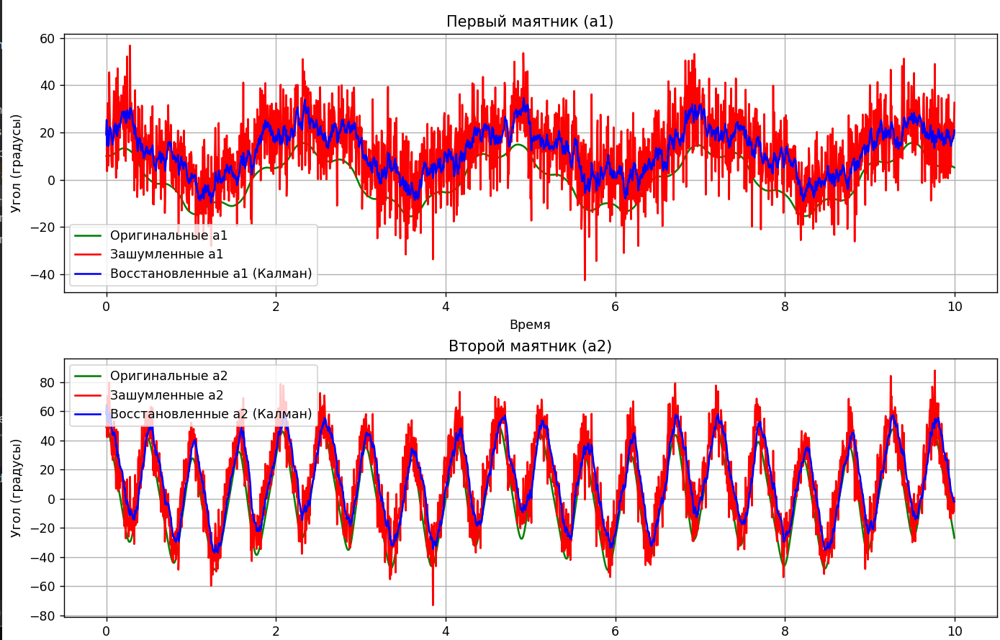

---

### Второй

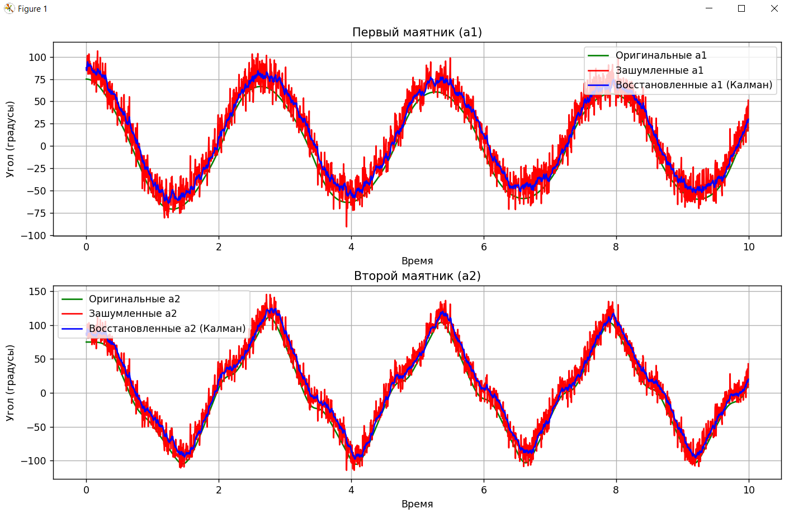
