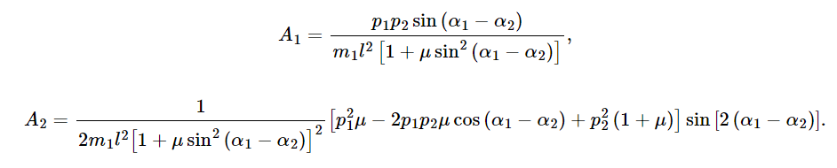

# Математическое моделирование колебаний двойного маятника методом Дормана-Принса 5 порядка

## Зависимости
Python3, numpy, matplotlib

## Описание
Для численного моделирования использовался метод Дормана-Принца 5 порядка.
На каждом шаге в качестве функции изменения угла отклонения использовалась следующие уравнения Гамильтона:

Здесь, a1, a2 - текущий угол 1 и 2 тел (второе тело прикреплено к первому), p1 и p2 - их инерция, A1 и А2 - вспомогательные переменные, l1 и l2 - длины стержней.

    

    

В учебной модели длины стержней взяты одинаковые (l1 = l2 = l), &mu; - отношение массы второго тела к массе первого, из-за чего система получает следующий вид:

    
    

    

Также к конечным результатам был применен шум, реализованный как случайное число в нормальном распределении, с мат ожиданием 0.2 и дисперсией 0.2.

## Пример результата

### Первый:

### Второй:

### Третий:

### Четвертый:

### Пятый:

### Шестой:

